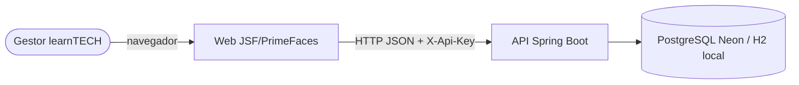
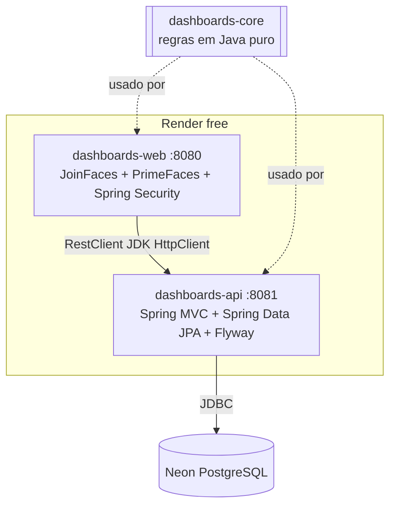
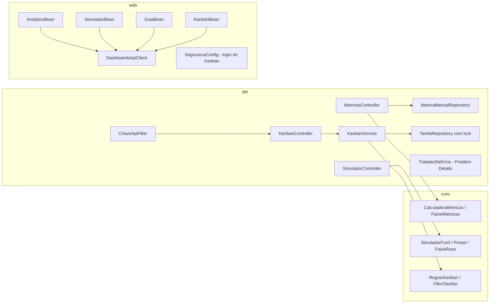

# Arquitetura — learnTECH OS / Growth Hub (Java)

## C4 — Contexto

## C4 — Contêineres

## C4 — Componentes

## Modelo de dados

| Tabela | Colunas | Regras |
|---|---|---|
| `metrica_mensal` | id, ano_mes (único), rotulo, gasto, cliques, conversas, cpc, cpa, fase | CHECK ≥ 0; fase 1 a 3 |
| `tarefa` | id, titulo, descricao, projeto, etapa, etapa_inicial, dia, ordem, versao | CHECK nos enums; índice em etapa; `versao` para concorrência |

## ADRs

| # | Decisão | Motivo | Alternativa descartada |
|---|---|---|---|
| ADR-01 | Maven multi-módulo core/api/web | Regras testáveis sem Spring e contrato único (records) entre api e web | Um único app Spring |
| ADR-02 | JSF/PrimeFaces via JoinFaces 5.5 sobre Spring Boot 3.5 | Decisão sua; JoinFaces 5.5 é a linha para Boot 3.5 | Spring Boot 4 + JoinFaces 6 (mais recente, menos material) |
| ADR-03 | Flyway com dados originais (V2) e `ddl-auto=none` | Banco versionado e fonte única dos dados | Seed em Java / Hibernate criando tabelas |
| ADR-04 | WIP garantido na API com `SELECT … FOR UPDATE` | Dois cliques simultâneos não furam o limite | Checar só na tela |
| ADR-05 | CPC ponderado (gasto ÷ cliques) | Bate com o R$ 0,94 do relatório | Média simples (R$ 1,07) |
| ADR-06 | Faixas de ROAS do termômetro (1 / 2,5 / 4,5) para tudo | Eram a única tabela sem buracos | Faixas da matriz do guia |
| ADR-07 | Kanban protegido (login na web, X-Api-Key na API); métricas públicas | Quadro tem dados internos; métricas já eram públicas | Tudo público (original) |
| ADR-08 | CSRF do Spring só em /login e /logout | JSF com estado no servidor já exige ViewState em cada POST | CSRF duplo com campo oculto em todo form |
| ADR-09 | Tema padrão (claro) do PrimeFaces | Contraste AA garantido; o tema escuro exige conferir nomes de tema da versão | Recriar o dark mode do Tailwind |
| ADR-10 | Render free (2 serviços Docker) + Neon PostgreSQL free | Hospedagem gratuita com Java | Railway/Fly (sem plano gratuito estável) |
